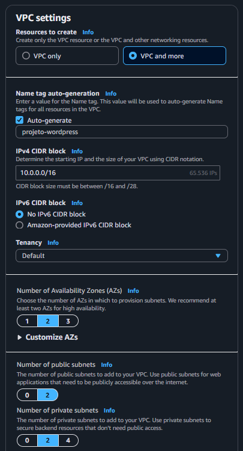
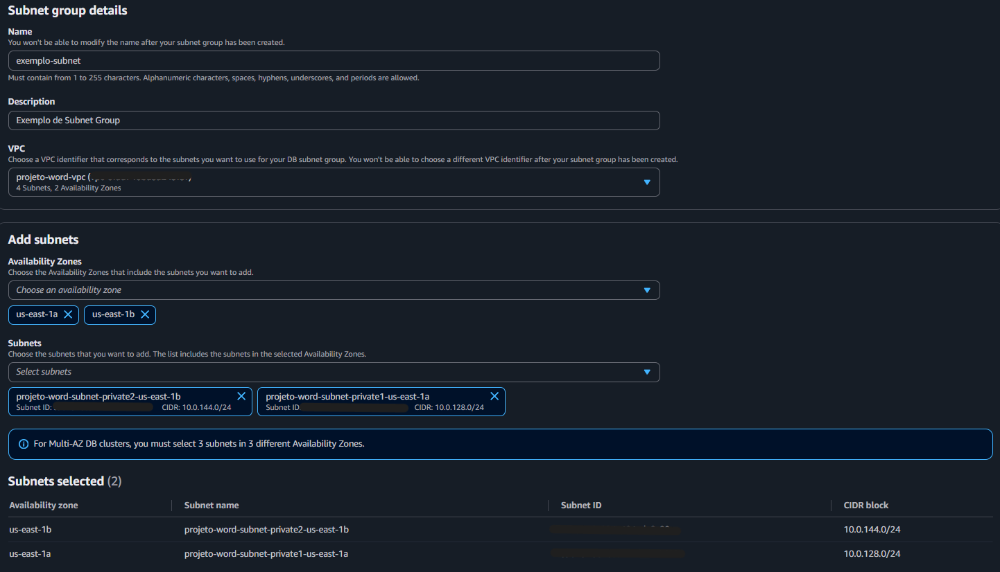
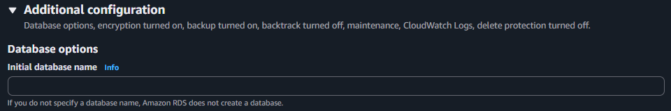
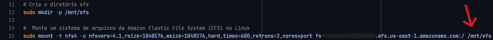
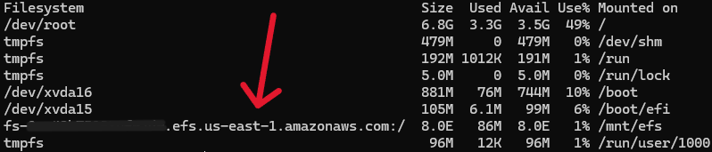
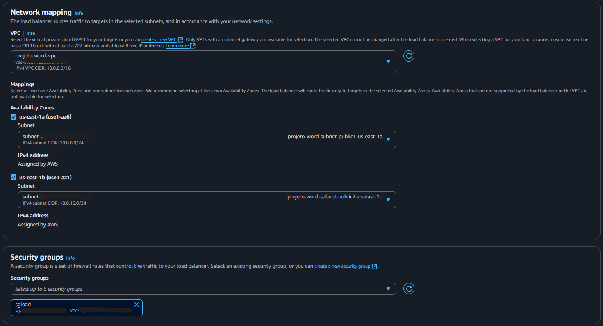
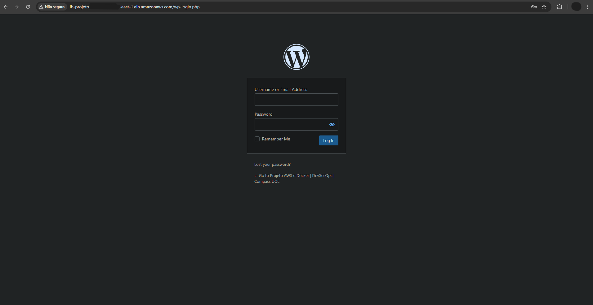

# Atividade Prática 2 | AWS & Docker | Compass UOL

Segunda atividade prática da trilha de **DevSecOps** do programa de bolsas da Compass UOL

 

## Tecnologias:
<li> AWS </li>
<li> Docker </li>
<li> Linux </li>
<li> Shell Script </li>

 

## Objetivos:
<li> Criar uma topologia de rede bem definida, com 4 sub-redes (2 públicas e 2 privadas) para separar os componentes da infraestrutura; </li>
<li> Configurar e instalar o Docker em duas instâncias EC2 para gerenciar o contêiner da aplicação; </li>
<li> Fazer o deploy de uma aplicação WordPress dentro de um contêiner nas instâncias EC2; </li>
<li> Configurar um banco de dados MySQL no RDS, garantindo alta disponibilidade e desempenho; </li>
<li> Utilizar o Amazon EFS para armazenar arquivos estáticos da aplicação, permitindo compartilhamento entre múltiplas instâncias; </li>
<li> Implementar um Load Balancer (ELB) para distribuir as requisições entre as instâncias da aplicação e melhorar a escalabilidade. </li>

 

## Índice:
1. [Criação da VPC](#1-criação-da-vpc)
2. [Criação e configuração dos Security Groups](#2-criação-e-configuração-dos-security-groups)
3. [Criação e configuração do banco de dados RDS](#3-criação-e-configuração-do-banco-de-dados-rds)
4. [Criação do EFS](#4-criação-do-efs)
5. [Criação das instâncias EC2](#5-criação-das-instâncias-ec2)
6. [Criação e acesso ao Bastion Host](#6-criação-e-acesso-ao-bastion-host)
7. [Criação e configuração do Load Balancer](#7-criação-e-configuração-do-load-balancer)
8. [Criação e configuração do Auto Scalling Group](#8-criação-e-configuração-do-auto-scalling-group)
9. [Resultado final](#9-resultado-final)

 

## 1. Criação da VPC

<li> A Amazon Virtual Private Cloud (Amazon VPC) permite iniciar recursos da AWS em uma rede virtual logicamente isolada que você mesmo define. </li>

 

**1.1** No painel da AWS, pesquise por "VPC" e acesse;  
**1.2** Navegue até "VPCs" e clique em "Create VPC";  
**1.3** Em "Resources to create", selecione "VPC and more";  
**1.4** Defina um nome para sua VPC;  
**1.5** Em "Number of Availability Zones (AZs)" selecione 2;  
**1.6** Em "Number of public/private subnets" selecione 2 para cada tipo;  
**1.7** Em "NAT gateways ($)" escolha "1 per AZ";  
**1.8** Em "VPC endpoints" escolha "None";  
**1.9** Clique em "Create VPC".  

  
Imagem de configuração da VPC 

  
|:--|

 

## 2. Criação e configuração dos Security Groups

<li> Um Grupo de Segurança (Security Group) atua como um firewall virtual visando controlar o tráfego de entrada e de saída. </li>

 

**2.1** Ainda no painel da VPC, na aba "Security" navegue até "Security Groups";  
**2.2** Clique em "Create security group" e realize a criação na seguinte sequência:  

**Load Balancer**  
<li>Regras de entrada: HTTP -> Anywhere-IPv4 </li>
<li>Regras de saída: padrão</li>

 

**EC2**  
<li>Regras de entrada: HTTP -> Custom: Load Balancer | SSH -> Anywhere-IPv4 </li>
<li>Regras de saída: padrão</li>

 

**RDS**  
<li>Regras de entrada: MySQL/Aurora -> Custom: EC2 </li>
<li>Regras de saída: padrão</li>

 

**EFS**  
<li>Regras de entrada: NFS -> Custom: EC2 </li>
<li>Regras de saída: padrão</li>

 

## 3. Criação e configuração do banco de dados RDS
<li> O Amazon Relational Database Service (Amazon RDS) é um serviço da Web que facilita a configuração, a operação e escalabilidade de um banco de dados relacional na Nuvem AWS. </li>

 

### Subnet Groups
**3.1** No painel da AWS, pesquise por "RDS" e acesse;  
**3.2** Navegue até "Subnet groups" e clique em "Create DB subnet group";  
**3.3** Defina um nome, descrição e selecione sua VPC;  
**3.4** Em "Availability Zones" escolha suas duas zonas de disponibilidade;  
**3.5** Em "Subnets" selecione suas duas sub-redes privadas;  
**3.6** Clique em "Create" para criar.  
 

### RDS
**3.7** Ainda no RDS, navegue até "Databases" e clique em "Create database";  
**3.8** Em "Engine type", selecione "MySQL";  
**3.9** Em "Templates" escolha "Free tier";  
**3.10** Em "Settings" defina um nome para O seu banco de dados RDS;  
**3.11** Em "Credentials Settings" defina um usuário admin e senha para o seu banco de dados RDS;  
**3.12** Em "Instance configuration" selecione a máquina "db.t3.micro";  
**3.13** Em "Connectivity" selecione:
- Sua VPC anteriormente criada;
- Seu Subnet Group do RDS;
- Em "Public access" selecione "No";
- O grupo de segurança do RDS.  

**3.14** Em "Additional configuration" defina um "Initial database name";  
**3.15** Por fim, desabilite o "Backup" e o "Encryption" e crie seu banco de dados RDS.  

 

  
Informação importante sobre o banco de dados RDS

  
|:--|
| IMPORTANTE: Defina um nome para o seu banco de dados, do contrário ele não será criado! |

### Ajustes finais
**3.16** Com o RDS configurado e on-line, copie o endpoint do banco de dados;  
**3.17** Cole este endereço endpoint no arquivo de script **user_data.sh** em frente ao parâmetro `WORDPRESS_DB_HOST`;  
**3.18** Além disso, preencha os valores de `WORDPRESS_DB_USER`, `WORDPRESS_DB_PASSWORD` e `WORDPRESS_DB_NAME`, assegurando que sejam consistentes com as informações configuradas anteriormente no momento de criação do seu banco de dados RDS.  

 

## 4. Criação do EFS
<li> O Amazon EFS é um sistema de arquivos simples, sem servidor, elástico, que aumenta e diminui automaticamente conforme você adiciona e remove arquivos, sem necessidade de gerenciamento ou provisionamento. </li>

 

**4.1** No painel da AWS, pesquise por "EFS" e acesse;  
**4.2** Navegue até "File systems" e clique em "Create file system";  
**4.3** No pop-up, clique em "Customize";  
**4.4** Defina um nome para seu EFS e clique em "Next";  
**4.5** Selecione sua VPC e suas sub-redes privadas;  
**4.6** Escolha o security group do EFS para cada uma;  
**4.7** Clique em "Next" duas vezes e então em "Create".  

### Após a criação
**4.8** Selecione seu EFS e clique em "Attach";  
**4.9** Copie o comando em "Using the NFS client" e cole-o em seu script para montar o EFS nas instâncias EC2.  
**Obs:** Não se esqueça de checar se ao final do comando no script há o caminho bem definido de **/mnt/efs**, NÃO deixe somente "efs" ou ocorrerá um erro e seu sistema de arquivos não será montado!  

 

## 5. Criação das instâncias EC2
<li> O Amazon Elastic Compute Cloud (Amazon EC2) fornece capacidade de computação escalável e sob demanda na nuvem AWS. </li>

 

**5.1** No painel da AWS, pesquise por "EC2" e acesse;  
**5.2** Navegue até "Instances" e clique em "Launch instances";  
**5.3** Defina seu nome e suas tags;  
**5.4** Escolha como AMI o Ubuntu em sua versão mais atual;  
**5.5** Em "Instance type" selecione a t2.micro;  
**5.6** Crie uma nova key pair .pem;  
**5.7** Em "Network settings", clique em "Edit";  
**5.8** Selecione sua VPC e sua sub-rede privada;  
**5.9** Clique em "Enable" no "Auto-assign public IP";  
**5.10** Selecione o security group de sua EC2;  
**5.11** Vá até "Advanced details" e em "User data" cole seu script;  
**5.12** Clique em "Launch instance".  

<li> Repita o mesmo processo para a criação de sua segunda instância EC2, sempre lembrando de colocar uma sub-rede privada diferente da que foi anteriormente escolhida. </li>

 

## 6. Criação e acesso ao Bastion Host
<li> Para acessarmos as instâncias privadas via SSH, podemos configurar um Bastion Host em uma sub-rede pública. </li>

 

**6.1** Crie uma nova instância EC2, porém com uma sub-rede pública, com uma nova chave .pem e sem um script user_data;  
**6.2** Acesse o CMD do Windows e navegue até a pasta onde estão armazenadas as chaves .pem;  
**6.3** Digite o comando "type" e o nome de uma das key pairs da EC2 **privada** que deseja se conectar;  
**6.4** Copie o conteúdo da key pair;  
**6.5** No painel de instâncias na AWS, selecione sua instância Bastion Host e clique em "Connect";  
**6.6** Na categoria "SSH Client" copie o último comando -> "Example";  
**6.7** Cole o comando e rode em seu CMD, escreva "yes" e permita a conexão SSH;  
**6.8** Após a conexão bem-sucedida, crie um novo arquivo .pem digitando o comando "nano exemplo-nome-chave-ec2-privada-1.pem";  
**6.9** Dentro do nano, cole o conteúdo de sua key pair anteriormente copiada, salve-o e saia do nano;  
**6.10** Dê permissão para o arquivo digitando o comando "chmod 400 exemplo-nome-chave-ec2-privada-1.pem";  
**6.11** De volta ao painel de instâncias na AWS, selecione sua instância privada e clique em "Connect";  
**6.12** Na categoria "SSH Client" copie o último comando -> "Example";  
**6.13** Cole o comando, mude o nome da chave para "exemplo-nome-chave-ec2-privada-1.pem" e rode em seu CMD;  
**6.14** Digite "yes" e permita a conexão SSH.  

### Testes para checar se está tudo funcionando
**6.15** Dê o comando `df -h` e veja se o sistema de arquivos EFS está montado:  

**6.16** Digite `sudo docker ps` e verifique se seu contêiner do WordPress está rodando.  

 

## 7. Criação e configuração do Load Balancer

<li> O Elastic Load Balancing (ELB) distribui automaticamente seu tráfego de entrada em vários destinos, como EC2 instâncias, contêineres e endereços IP, em uma ou mais zonas de disponibilidade. </li>

 

**7.1** Ainda na EC2, navegue até "Load Balancers" e clique em "Create load balancer";  
**7.2** Selecione o "Classic Load Balancer" e clique em "Create";  
**7.3** Defina um nome para seu Load Balancer e selecione sua VPC;  
**7.4** Escolha suas duas zonas de disponibilidade e selecione suas sub-redes **públicas**;  
**7.5** Selecione o grupo de segurança de seu Load Balancer;  
**7.6** Em "Health checks" mude o "Ping path" para /wp-admin/install.php;  
**7.7** Em "Instances", clique em "Add instances" e selecione as duas instâncias EC2 privadas;  
**7.8** Por fim, clique em "Create load balancer";  

Após configurado, o Load Balancer gera um DNS que pode ser utilizado para acessar o site do WordPress através do navegador, indepedente da instância utilizada.

 

## 8. Criação e configuração do Auto Scalling Group

<li> O AWS Auto Scaling monitora os aplicativos e ajusta automaticamente a capacidade para manter um desempenho constante e previsível pelo menor custo possível. </li>

 

### Launch Template
**8.1** Ainda na EC2, navegue até "Launch Templates" e clique em "Create launch template";  
**8.2** Selecione o Ubuntu como AMI e a "Instance type" como "t2.micro";  
**8.3** Em "Network settings" selecione o grupo de segurança das instâncias EC2;  
**8.4** Em "Resource tags" adicione as tags necessárias para que a instância suba;  
**8.5** Em "Advanced details" cole o script das instâncias EC2;  
**8.6** Clique em "Create launch template".  
 

### Auto Scalling Group
**8.7** Ainda na EC2, navegue até "Auto Scalling Groups" e clique em "Create Auto Scalling group";  
**8.8** Defina um nome para o seu Auto Scalling Group e selecione o template previamente criado no passo anterior;  
**8.9** Clique em "Next";  
**8.10** Selecione sua VPC e suas sub-redes privadas;  
**8.11** Clique em "Next" e depois em "Attach to an existing load balancer";  
**8.12** Clique em "Choose from Classic Load Balancers" e selecione o seu Load Balancer existente;  
**8.13** Deixe o restante das configurações padrão e clique em "Create Auto Scalling group".  

 

## 9. Resultado final

